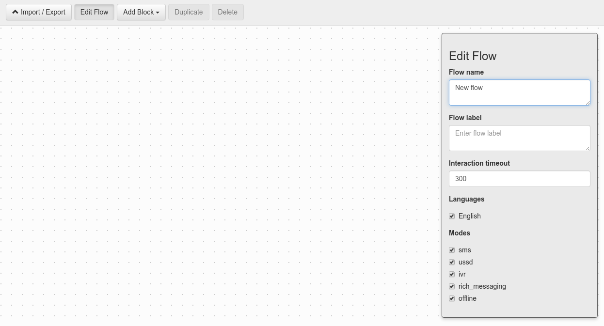
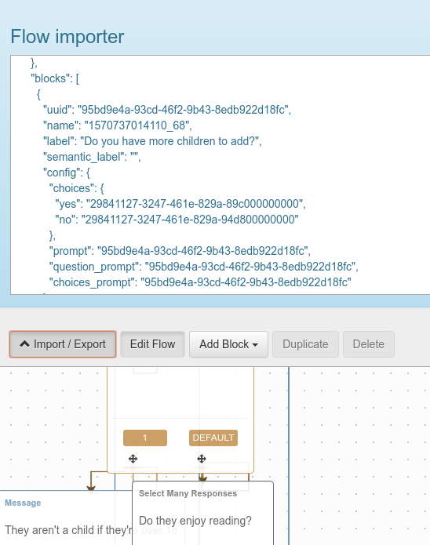

# flow-builder

flow-builder provides an open source frontend for authoring [flow interoperability project specification](https://floip.gitbook.io/flow-specification/) compliant flows. It enables the importing, editing and exporting of flow json, as well as authoring from scratch. Such flows can then be run using a compatible flow runner such as [FLOIP/flow-runner](https://github.com/FLOIP/flow-runner).

## Usage

To begin, you can create a new flow by visiting X. From there, you can either start with a blank flow (a flow without blocks) and get editing:



Or you can use the Import/Export panel and copy in an existing flow:



Edits using the builder will then be reflected in the flow JSON in this panel and vice versa.

## Project setup
```
yarn install
```

### Compiles and hot-reloads for development
```
yarn serve
```

### Compiles and minifies for production
```
yarn build
```

### Run your unit tests
```
yarn test:unit
```

### Lints and fixes files
```
yarn lint
```

### Customize configuration
See [Configuration Reference](https://cli.vuejs.org/config/).
